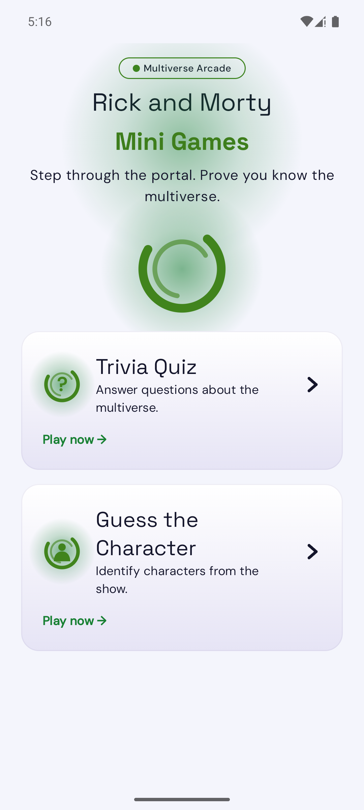
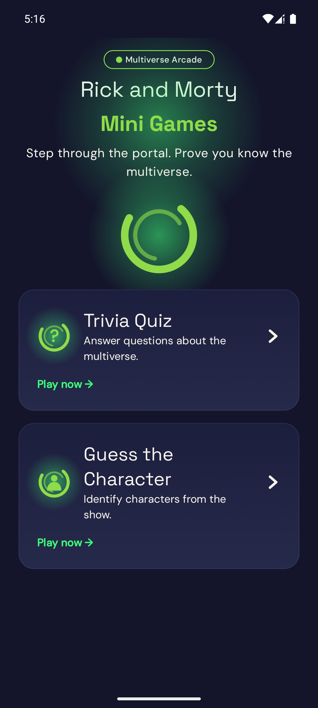
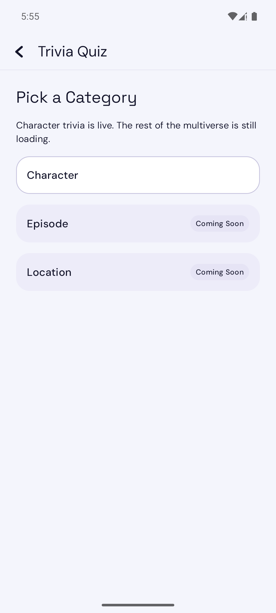
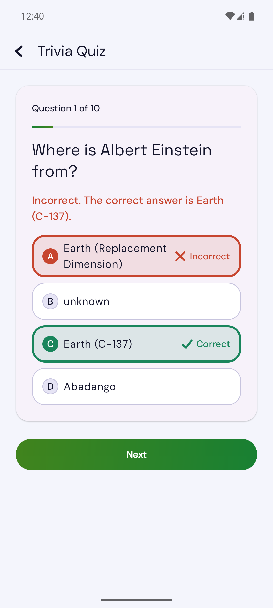
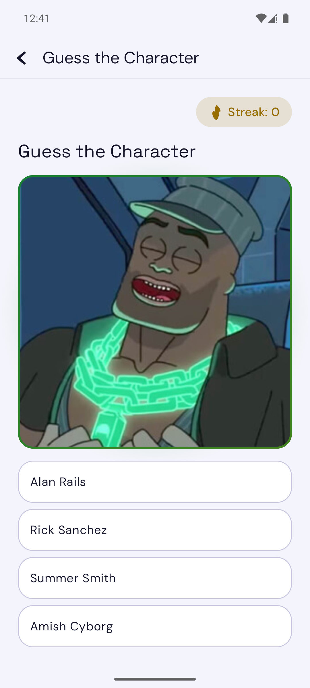
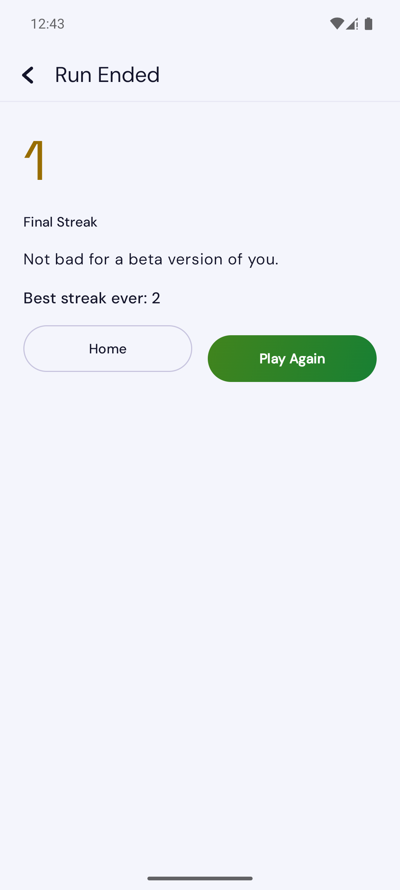

# Rick and Morty — Multiverse Mini Games

A Kotlin Multiplatform / Compose Multiplatform game app built on the public [Rick and Morty API](https://rickandmortyapi.com), featuring a **Trivia Quiz** and a **Guess the Character** game mode — Clean Architecture, multi-module, offline-first, with a full light/dark design system and Android 12+ splash/13+ themed icon support.

> **Portfolio / educational project.** Not affiliated with, endorsed by, or sponsored by Adult Swim, Cartoon Network, or Warner Bros. Discovery. Character data and images are sourced from the unofficial, community-run [rickandmortyapi.com](https://rickandmortyapi.com). This repository is not published to any app store.

---

## Screenshots

| Home | Home (dark) | Category Select |
|---|---|---|
|  |  |  |

| Trivia — answer feedback | Guess the Character | Run Ended |
|---|---|---|
|  |  |  |

All captured on a real Android emulator running a debug build off `master`.

---

## What's in the app

- **Trivia Quiz** — 10 multiple-choice questions generated at runtime from live character data (status, species, gender, origin), colorblind-safe answer feedback, no running score during play, full results review at the end.
- **Guess the Character** — identify a character from their portrait, live streak counter, distractors preferentially drawn from same-species/status characters for difficulty, persisted best-streak-ever.
- **Offline-first** — character data and images are cached locally (Room + Coil disk cache); both modes remain playable after the first successful session with no connection.
- **Light + dark themes**, WCAG AA–verified contrast on every text/fill pairing.
- **Full accessibility pass** — screen-reader focus management, live-region announcements, colorblind-safe feedback (never color alone), 200%-scale-safe layouts, and a reduced-motion fallback on every animation in the app.
- **Native Android 12+ splash screen** and an **adaptive app icon with Android 13+ Material You theming support**.

---

## Architecture

Clean Architecture, strict inward dependency rule, one Gradle module per layer:

```
:app                    Android + iOS entry points, NavHost, Koin bootstrap
├── :feature:quiz               Trivia Quiz — ViewModel + Compose UI
├── :feature:guesscharacter     Guess the Character — ViewModel + Compose UI
├── :feature:characters         scaffolded, not yet wired to Home
├── :core:domain                pure Kotlin — models, use cases, repository interfaces (zero framework deps)
├── :core:data                  repository implementations, DTO/Entity ↔ domain mappers
├── :core:network                Ktor client, DTOs, API services
├── :core:database               Room (KMP), cache + local game-state schema
├── :core:designsystem           theme, shared Compose components, motion system
└── :core:common                 shared utils, dispatchers
```

- **Dependency direction:** `:app` → `:feature:*` → `:core:domain` + `:core:designsystem`. Features never depend on `:core:data`/`:core:network`/`:core:database` directly — only on domain-owned interfaces. `:core:domain` depends on nothing.
- **Offline-first repositories:** network-first with cache write-through; on failure, silently fall back to whatever's cached rather than throwing — verified with dedicated offline/online/empty-cache test suites.
- **State machines, not nested navigation:** each feature screen is driven by a single sealed UI state (`CategorySelect → Loading → Question → Results`, etc.) rather than a nested `NavHost`, to avoid a second source of truth against the ViewModel.

---

## Tech stack

| Layer | Choice |
|---|---|
| Language / UI | Kotlin Multiplatform, Compose Multiplatform |
| Networking | Ktor Client + kotlinx.serialization |
| Persistence | Room 2.8+ (KMP, Bundled SQLite driver) |
| DI | Koin |
| Images | Coil 3, explicit per-platform disk cache |
| Navigation | Navigation-Compose (JetBrains KMP fork), type-safe `@Serializable` routes, animated transitions |
| Fonts | Space Grotesk (headlines) + DM Sans (body/UI), embedded OFL Google Fonts |
| Testing | `kotlin.test`, JUnit, Compose UI Test, Android instrumented tests, [Maestro](https://maestro.mobile.dev) E2E flows |
| CI | GitHub Actions — build + full test suite on every PR |

Targets Android (buildable/runnable) and iOS (scaffolded — Kotlin/Native targets are gated to macOS hosts, since Xcode is required to link them; the iOS app hasn't been run on-device).

---

## Design system

Built from the ground up around the show's own portal-green palette (researched against real on-screen colors, not a generic sci-fi green) rather than a template theme:

- **Color tokens** (`core:designsystem`) — separate light/dark palettes, every text/fill pairing passing an automated WCAG AA contrast test (`ColorContrastTest`), with a dedicated `accent` token deliberately scoped to glow/badge/link-text use only, never large fills or body text.
- **Portal-ring glyph** — a single Canvas-drawn primitive (ring + radial-gradient glow), reused across the Home hero, mode cards, the app icon, and the splash screen instead of shipping bespoke art for each.
- **Motion system** — every animated moment (press feedback, answer-lock, feedback reveal, streak celebration, screen transitions) is gated by a shared `rememberReducedMotionEnabled()` primitive that reads the OS accessibility setting live; every animation has a static, instant fallback.
- **No native shadows** — glow/elevation effects are hand-drawn gradients (`Canvas`/`drawBehind`) rather than `Modifier.shadow`, for consistent rendering across Compose Multiplatform targets.

---

## Testing strategy

Three layers, each covering what the others can't — added incrementally, never at the expense of one another:

- **Unit tests** (`commonTest`, `kotlin.test`) — use-case logic, ViewModel state machines, DTO/entity mappers, and even the color system (`ColorContrastTest` asserts every text/fill pairing meets WCAG AA). Fast, no device needed.
- **Compose UI / instrumented tests** (`androidInstrumentedTest`, real emulator) — accessibility-tree correctness (merged semantics, hidden decorative nodes, live regions) and real Room persistence. Scoped to single screens/components, not multi-screen journeys.
- **Maestro E2E flows** (`.maestro/flows/`) — black-box journeys through the actual installed app (real Koin, real network, real database), covering what the other two layers can't: tapping through a full 10-question quiz to Results, building a streak in Guess the Character to Run Ended, both exit-confirmation dialogs. This replaces what used to be manual tap-through verification on every PR.

Added by SENTINEL (test strategy) and FORGE after auditing the existing suite — full flow list in `.maestro/flows/`, run locally with `maestro test .maestro/flows/` against a device with the debug build installed. Not wired into CI yet; that's a deliberate, separate later decision once the flow suite has proven stable, rather than bolting a multi-minute emulator boot onto every PR from day one.

One flow (`guess_character_exit_confirmation`) is honestly documented as flaky rather than forced to pass: it needs a nonzero streak before a single wrong answer ends the run, and the correct answer is randomized from live API data (~25% odds per guess) with no deterministic seed to control it yet — tracked in [issue #59](../../issues/59).

---

## Built by an AI engineering squad

This project was built end-to-end by a small squad of specialized Claude agents working from a shared engineering charter, coordinated through a real GitHub repo — issues, a Kanban board, and one pull request per task:

| Agent | Role |
|---|---|
| **NOVA** | Product — scoped the MVP, broke it into a dependency-ordered backlog of GitHub issues |
| **ATLAS** | Architecture — chose the KMP/Clean Architecture/multi-module structure, the tech stack, and the module dependency rules |
| **LUMA** | UX/Design — wrote the UX specs, the full design-system palette (light + dark), component redesigns, and the app's motion language |
| **FORGE** | Engineering — implemented every issue: features, data layer, design system, CI, accessibility, app icon, splash screen |

**Workflow used for every single change in this repo:** create a branch → an agent implements the issue end-to-end (including its own tests) → a full local build + test run → install and manually verify on a real emulator → commit → push → open a PR → wait for GitHub Actions CI → review the diff → merge → move to the next issue. Nothing was merged without a green CI run and an actual on-device check, not just "the code compiles."

The squad also caught and fixed several real bugs along the way rather than just doing what was asked — among them: a WCAG contrast failure in the original color proposal (6 values darkened, documented), an Android system back-button that silently bypassed a streak-loss confirmation dialog, a missing Android 13+ themed-icon layer, and a Coil version incompatible with the project's pinned Kotlin version.

The full backlog — product scoping, architecture decisions, UX specs, and every implementation issue — is public on the repo's [Issues](../../issues?q=is%3Aissue+is%3Aclosed) tab and [Project board](../../projects).

---

## Getting started

Requirements: JDK 21, Android SDK (compileSdk 37 / minSdk 24). iOS build requires Xcode on macOS (not set up/verified in this repo yet).

```bash
# Build everything and run the full test suite
./gradlew build

# Install and run on a connected device/emulator
./gradlew :app:installDebug

# Run instrumented tests (needs a running emulator/device)
./gradlew :app:connectedDebugAndroidTest
```

CI (`.github/workflows/ci.yml`) runs the same `build` on every pull request against `master`.

---

## Data source

All character data and images come from [rickandmortyapi.com](https://rickandmortyapi.com) — a free, public, community-run REST API. No authentication, no rate limit published, GET-only. This project consumes it read-only; it does not host or redistribute any of the underlying data or images itself.
